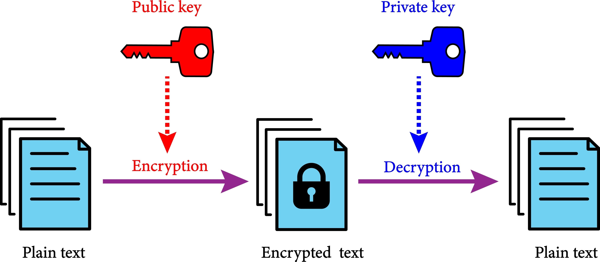

Imagine you have a million dollars in gold. You buy the most expensive, impenetrable safe in the world to store it in your vault. But then, to move it to the bank, you put the gold in a cardboard box and carry it down the street in an open wagon.

Sounds ridiculous, right?

Yet, this is exactly what happens in Cloud Security when engineers focus solely on Encryption at Rest while neglecting Encryption in Transit. As a Cybersecurity professional, understanding the distinction isn't just academic—it's the difference between a secure audit and a headline-making breach.

## A. The Concept (The ELI5) Let’s break down the jargon.


Encryption at Rest (The Safe): This protects data that isn't moving. Think of databases, hard drives, or S3 buckets. If a bad actor physically steals the hard drive from the data center, the data is unreadable without the key.

Encryption in Transit (The Armored Truck): This protects data while it travels from Point A to Point B. Whether it’s traveling over the public internet or across your private office network, this prevents "Man-in-the-Middle" attacks where hackers "sniff" the wire to steal passwords or data packets.

## B. The "Hello World" (Technical Proof) 
This Theory is great, but how do we enforce this in the real world? If you are working in AWS, you can't just "hope" your team uses HTTPS. You have to force them.

Here is a Python (Boto3) snippet I use to automate the creation of a bucket that guarantees both types of safety.

```python
import boto3
import json

s3 = boto3.client('s3')
bucket_name = "my-secure-data-bucket-mabele"

# 1. Create Bucket
s3.create_bucket(Bucket=bucket_name)

# 2. Enforce Encryption AT REST (Server-Side Encryption)
s3.put_bucket_encryption(
    Bucket=bucket_name,
    ServerSideEncryptionConfiguration={
        'Rules': [{'ApplyServerSideEncryptionByDefault': {'SSEAlgorithm': 'AES256'}}]
    }
)

# 3. Enforce Encryption IN TRANSIT (Bucket Policy denying HTTP)
bucket_policy = {
    "Version": "2012-10-17",
    "Statement": [{
        "Sid": "EnforceTLS",
        "Effect": "Deny",
        "Principal": "*",
        "Action": "s3:*",
        "Resource": [f"arn:aws:s3:::{bucket_name}", f"arn:aws:s3:::{bucket_name}/*"],
        "Condition": {
            "Bool": {"aws:SecureTransport": "false"}
        }
    }]
}
s3.put_bucket_policy(Bucket=bucket_name, Policy=json.dumps(bucket_policy))

print("Bucket Secured: Rest + Transit enforcement active.")
</code></pre>

The "Gotcha" (Business Impact) The biggest mistake I see in corporate environments is relying too much on "Encryption at Rest."

The Truth: Encryption at Rest only protects you if someone steals the physical hardware. It does not protect you if a hacker guesses your admin password. Once the database is "on," it decrypts data for authorized users.

This is why Compliance Frameworks (like HIPAA, PCI-DSS, or SOC2) demand both. If you are auditing a system, never check a box just because you see "AES-256." Ask: "How is this data getting here?"

Security is a chain, and it's only as strong as its weakest link. Don't build a steel vault and then transport your data in a cardboard box.